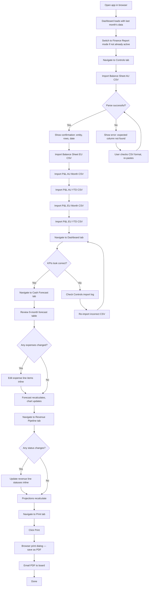
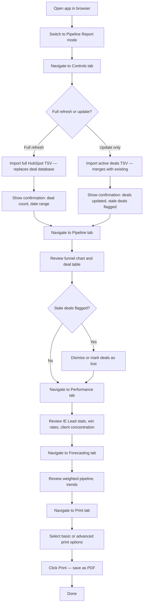
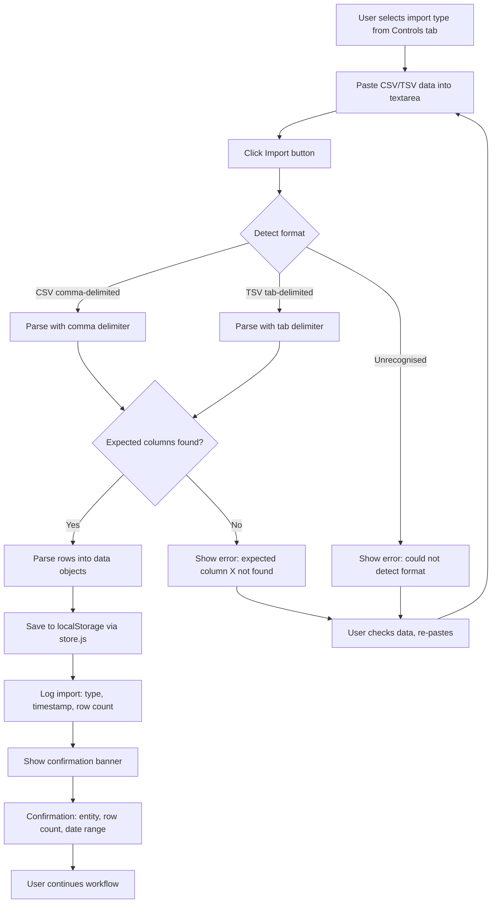

# UX Design Specification — WWRI Toolkit

**Author:** Angelus
**Date:** 2026-03-30

---

<!-- UX design content will be appended sequentially through collaborative workflow steps -->

## Executive Summary

### Project Vision

The WWRI Toolkit is a browser-based executive reporting application for Whitewater Reinventions, refactored from monolithic single-HTML files into a modular, maintainable architecture. The core application consolidates two reporting functions — sales pipeline analytics (HubSpot) and financial reporting (Xero) — into a unified tool with a shared data layer. The UX goal is to make monthly board reporting faster, more reliable, and less error-prone, while producing the same professional-grade PDF output the board already expects.

### Target Users

**Primary — Angelus (Admin & Finance Manager)**
Generates monthly board reports, manages the deal pipeline, tracks cash flow across three legal entities (AU, EU, US). Works on desktop Chrome. Needs tools that are fast to operate, produce reliable calculations, and print clean A4 reports. Success looks like: monthly reporting in 20 minutes with zero manual workarounds.

**Secondary — Whitewater Consultants (Phase 2/3)**
Use project costing sheets and structured interview tools in client meetings. Need tablet/iPad Safari support, offline capability, and client-ready PDF output. Not in scope for MVP UX design.

### Key Design Challenges

1. **Information density** — Financial reports contain dense tabular data across multiple entities, currencies, and time periods. The UX must present this clearly and scannably without sacrificing completeness.
2. **Dual-mode navigation** — Two reporting modes (Pipeline: 7 tabs, Finance: 5 tabs) share an app shell. The user must always know which mode they are in, and switching must feel seamless, not disorienting.
3. **Inline editing confidence** — Revenue lines, expense forecasts, and reference data are edited in-place. Changes must feel immediate, with visible feedback that calculations have updated and data has been saved.
4. **Print-first output** — The primary deliverable is a printed PDF. Print layouts must produce clean, professional A4 output with no regression from the current tools.

### Design Opportunities

1. **Import workflow clarity** — Seven CSV formats imported through Controls. Clear status messages, parse confirmations, and an activity log turn an anxious manual process into a confident, guided workflow.
2. **Dashboard as health check** — The Finance Dashboard (KPIs, entity summary) can serve as an immediate "everything looks right" confirmation, reducing the need to inspect individual tabs after each import.
3. **Visual consistency across modes** — Shared theme, table patterns, card styles, and chart aesthetics make mode switching feel like navigating within one app, not juggling two.

## Core User Experience

### Defining Experience

The defining experience of the WWRI Toolkit is the **monthly reporting cycle**: import fresh data from external sources (Xero CSVs for finance, HubSpot TSV for pipeline), review and adjust the numbers across purpose-built tabs, and print a board-ready PDF. This import → verify → print loop is the core interaction that every UX decision must serve.

The app is not exploratory or discovery-oriented — Angelus knows exactly what she needs to do each month. The UX must support a confident, practised workflow where each step flows naturally into the next.

### Platform Strategy

- **Primary platform:** Desktop web application served via VS Code Live Server
- **Primary browser:** Chrome (development and production use)
- **Input method:** Mouse and keyboard — no touch optimisation for MVP
- **Offline:** Not required for MVP (all data is local via localStorage; no network dependency)
- **Future platforms:** iPad Safari for consultant tools (Phase 2/3) — not in scope for this design
- **No responsive/mobile layouts in MVP** — the app targets a desktop viewport for data-dense reporting

### Effortless Interactions

- **Mode switching** — One click toggles between Pipeline Report and Finance Report. Instant, no loading state, no confirmation dialog.
- **Tab navigation** — Clicking a tab renders content immediately. All data is local; there is nothing to fetch.
- **Inline editing** — Changing an expense line item, revenue status, or FX rate updates calculations and charts in real time. No save button, no confirmation step.
- **CSV import** — Paste data into the import area, receive clear confirmation of what was parsed (entity, record count, date range). One action per import.
- **Automatic cascading** — Edit a value and every dependent calculation updates: expense change → forecast recalculation → chart redraw → KPI update. The user sees the effect immediately.

### Critical Success Moments

1. **"The numbers are right"** — After importing this month's CSVs, the Dashboard KPIs (revenue, gross profit, operating profit, cash position) match expectations. Trust is established in seconds.
2. **"The PDF looks professional"** — Print preview produces a clean A4 layout with correct data, proper formatting, and the Whitewater brand. Ready to email to the board without adjustment.
3. **"I found it instantly"** — Any piece of data (an FX rate, a deal, a revenue line) is reachable within one mode switch and one tab click. No hunting through menus or modal dialogs.
4. **"It just saved"** — Edits persist to localStorage automatically. Close the browser, reopen, everything is exactly as left. Backup export provides a safety net.

### Experience Principles

1. **Trust the numbers** — Every calculation is visible, traceable, and updates in real time. No black boxes, no hidden logic. If a KPI looks wrong, the user can trace it back through the tabs to the source data.
2. **Print is the product** — Screen layouts serve the workflow; print layouts serve the board. Both must be excellent, but the printed PDF is the actual deliverable. Print fidelity is non-negotiable.
3. **One click away** — Any data surface is reachable within one mode switch + one tab click. No drilling into sub-pages, no modal workflows, no multi-step navigation. The tab bar is the primary navigation and it is always visible.
4. **Silent persistence** — Data saves automatically to localStorage on every change. The user never thinks about saving. Recovery is always available via JSON backup export.

## Desired Emotional Response

### Primary Emotional Goals

1. **Confidence** — "The numbers are right. I don't need to double-check everything." The user trusts the tool's calculations and data handling implicitly.
2. **Control** — "I know where everything is. I can find and change anything quickly." The interface is predictable and navigable without thought.
3. **Efficiency** — "This took 20 minutes. I'm done. Moving on." The workflow is fast, with no unnecessary friction or steps.
4. **Professional pride** — "This report looks sharp. I'm proud to send this to the board." The output reflects well on both the tool and the person producing it.

### Emotional Journey Mapping

| Stage | Desired Feeling | What Supports It |
|-------|----------------|-----------------|
| Opening the app | Calm, oriented | Dashboard shows current state at a glance |
| Importing CSVs | Confident, not anxious | Clear confirmations, record counts, activity log |
| Reviewing data across tabs | In control, focused | Dense but scannable tables, instant tab switching |
| Making adjustments | Responsive, trusted | Inline edits cascade immediately, no save friction |
| Printing the report | Professional pride | Clean A4 layout, Whitewater brand, board-ready |
| Something goes wrong | Safe, not panicked | Backup/restore available, clear error messages |
| Returning next month | Familiar, effortless | Everything where she left it, same workflow each time |

### Micro-Emotions

- **Confidence over confusion** — Every number is traceable. No "where did this figure come from?" moments. Calculations are visible, not hidden.
- **Trust over scepticism** — If the user has to mentally verify the app's calculations, the UX has failed. The tool earns trust through transparency and consistency.
- **Accomplishment over frustration** — The workflow ends with a clean, professional output — not with "I think that's right."

**Emotions to actively avoid:**
- **Anxiety** — "Did the import work? Did I lose data?"
- **Doubt** — "Is this number right? Should I check manually?"
- **Overwhelm** — "There's too much on this screen, I don't know where to look."

### Design Implications

- **Confidence** → Show parse results after every CSV import (entity, record count, date range). Display "last imported" timestamps on Controls tab. Make calculation sources visible.
- **Control** → Flat navigation — mode switcher and tab bar always visible. No hidden menus, nested pages, or modal workflows.
- **Efficiency** → No confirmation dialogs for routine actions. No "are you sure?" for saves. Reserve confirmations exclusively for destructive actions (clear all data, restore from backup).
- **Professional pride** → Print CSS receives equal design attention to screen CSS. Logo, typography, spacing, and layout must look polished and intentional.
- **Safety** → Specific, actionable error messages: "Could not parse Balance Sheet AU — expected column 'Account' not found" rather than generic errors or silent failures.

### Emotional Design Principles

1. **Transparency builds trust** — Show the user what happened (import confirmations, calculation breakdowns, activity logs). Never hide state changes.
2. **Silence means success** — Routine operations (save, calculate, render) happen without interruption. The app only speaks up when something needs attention.
3. **Errors are guidance, not blame** — When something goes wrong, tell the user what happened, why, and what to do next. Never show raw errors or fail silently.
4. **Familiarity compounds confidence** — The interface should feel the same every month. Consistency in layout, interaction patterns, and visual language means the user gets faster and more confident over time, not less.

## UX Pattern Analysis & Inspiration

### Inspiring Products Analysis

The primary inspiration source is the existing WWRI toolkit — four vibecoded monolithic HTML files that already solve the right problems for monthly board reporting. These tools have been used in production and their UX patterns are validated by real use. The refactor preserves what works while gaining maintainability.

**What the current tools get right:**
1. **Tab-based navigation** — Separates concerns clearly. Users know where to find each function.
2. **Dense data tables** — The board expects detailed numbers, not simplified visualisations. Information density is a feature, not a problem.
3. **Inline editability** — Expense lines, revenue statuses, and FX rates are editable in place without separate forms or modals.
4. **Print-first output** — Board-ready A4 PDFs produced via `@media print`. The output format is proven and expected.
5. **CSV paste import** — Paste from clipboard rather than file upload dialogs. Fast and direct for a monthly workflow.

**Supplementary patterns from established tools:**
- **Xero** — Clean import confirmation feedback, status badges on financial line items, scannable table layouts
- **Stripe Dashboard** — KPI cards as summary anchors at the top of data-dense pages, clear visual hierarchy
- **Google Sheets** — Persistent tab bar with clear active state, immediate inline editing, no-friction data entry

### Transferable UX Patterns

**Navigation Patterns:**
- Persistent tab bar with clear active state — the user always knows where they are (Google Sheets, most SaaS dashboards)
- Mode switcher as a top-level toggle, visually distinct from tab navigation — prevents confusion between "which mode" and "which tab" (adapted from multi-workspace patterns)

**Interaction Patterns:**
- KPI cards as page anchors — headline numbers (revenue, profit, cash position) displayed as styled cards before detail tables (Stripe Dashboard, Xero)
- Status badges on data rows — colour-coded indicators for revenue status (Contracted/Certain/Uncertain) and deal stages, scannable at a glance (Xero invoices, HubSpot deals)
- Import confirmation feedback — after CSV paste, show what was received: entity, record count, date range. Clear, immediate, non-modal (Xero bank imports)

**Visual Patterns:**
- Consistent table styling across all tabs — same column alignment, row spacing, and hover states regardless of mode (established data table conventions)
- Subtle visual differentiation between editable and read-only cells — editable fields have a light background tint or border, read-only cells do not (spreadsheet convention)

### Anti-Patterns to Avoid

1. **Wizard-style multi-step imports** — No "Step 1 of 4" dialogs for routine CSV imports. This is a monthly workflow; one action per import.
2. **Modal dialogs for data entry** — No popups to edit a single field. Inline editing is the established pattern.
3. **Dashboard-only views that hide detail** — No executive dashboards that require drilling to find actual numbers. The board wants the data.
4. **Auto-save noise** — No "Saving..." spinners or toast notifications on every change. Silent persistence means no visual interruption.
5. **Hidden navigation** — No hamburger menus or collapsible sidebars. The tab bar is always visible on a desktop viewport.
6. **Confirmation dialogs for routine actions** — No "Are you sure?" for saves or tab switches. Reserve confirmations for destructive actions only.

### Design Inspiration Strategy

**Adopt directly:**
- Tab-based navigation with persistent, visible tab bar
- KPI summary cards at the top of dashboard views
- Inline editing for all editable data (expenses, revenue lines, FX rates)
- CSV paste-to-import with immediate confirmation feedback
- Print layouts via `@media print` with dedicated CSS

**Adapt for this project:**
- Status badges — adapt Xero/HubSpot patterns for revenue pipeline statuses and deal stages, using the project's theme colours
- Import feedback — adapt Xero's bank import confirmation pattern to show entity, format, record count, and date range per CSV import

**Avoid entirely:**
- Multi-step wizards, modal forms, hidden menus, auto-save notifications, simplified dashboards that hide numbers

## Design System Foundation

### Design System Choice

**Custom lightweight design system** — hand-built CSS custom properties and shared component stylesheets, following Terra Mortis conventions. No external framework or component library.

This is not a choice between options — it is the natural consequence of the project's architectural constraints (no npm, no build step, no framework) and its alignment with established patterns from the sister project.

### Rationale for Selection

1. **No build step constraint** — The project explicitly prohibits npm packages, bundlers, and frameworks. Every established component library (Material, Ant, Chakra, Tailwind) requires tooling that conflicts with this constraint.
2. **Terra Mortis alignment** — The sister project establishes conventions for CSS custom properties, BEM-lite naming, and file structure. Using the same approach means patterns transfer between projects and are familiar to both developers.
3. **Scope is bounded** — The app has ~10 distinct view types across two modes. A full design system with dozens of component variants would be overengineered. A focused set of shared styles (tables, forms, cards, charts) covers the actual needs.
4. **AI-friendly** — Small, focused CSS files are cheaper to work with in AI-assisted development than framework-specific abstractions.

### Implementation Approach

**Design tokens (`theme.css`):**
- Colour palette as CSS custom properties (brand colours, semantic colours for status, background/surface/text hierarchy)
- Typography scale (font family, size scale, weight scale, line heights)
- Spacing scale (consistent margin/padding values)
- Border radii, shadows, and transition values

**Shared component styles (`public/css/shared/`):**
- `tables.css` — data tables with consistent column alignment, row hover, alternating row tints, editable cell styling
- `forms.css` — input fields, textareas (CSV paste), select dropdowns, buttons
- `cards.css` — KPI cards, summary cards with consistent padding and visual hierarchy
- `charts.css` — SVG chart containers, axis labels, legend styling

**Feature styles (`public/css/finance/`, `public/css/pipeline/`):**
- Layout-specific styles per tab (grid arrangements, section spacing)
- Feature-specific patterns (status badges for revenue pipeline, funnel chart for pipeline)

**Print styles (`print-finance.css`, `print-pipeline.css`):**
- Separate `@media print` stylesheets
- Page break control, header/footer handling, logo placement
- Optimised for A4 portrait output

### Customisation Strategy

- All visual customisation happens through `theme.css` custom properties — changing a colour value propagates everywhere
- No hardcoded hex values outside `theme.css`
- Component styles reference tokens, not raw values (e.g., `color: var(--color-text-primary)`, not `color: #333`)
- Adding a new tab or view means creating a feature CSS file that composes shared component classes — no new design system work required
- The Whitewater brand (logo, colours) is applied through theme tokens, not baked into component CSS

## Defining Experience

### Core Interaction

**"Import this month's data, see the numbers update, print the report."**

The defining experience is the monthly reporting cycle — a sequential, practised workflow where Angelus imports fresh CSVs from Xero and HubSpot, verifies the calculated outputs across tabs, makes targeted adjustments, and prints a board-ready PDF. The moment the Dashboard populates with correct numbers after import is the product's defining success moment.

### User Mental Model

Angelus approaches the toolkit as a monthly checklist:
1. Export CSVs from Xero and HubSpot (external — outside the app)
2. Open the toolkit, navigate to Controls, import each CSV in sequence
3. Check the Dashboard — do the headline KPIs look right?
4. Review Cash Forecast — adjust changed expenses
5. Review Revenue Pipeline — update deal statuses
6. Print the report and send to the board

The mental model is **sequential, predictable, and methodical**. Not exploratory or creative — the user knows exactly what needs doing and follows the same path each month. The app must support this practised workflow without introducing new steps or unfamiliar patterns.

The existing monolithic tools already establish this workflow. The refactored app must feel at least as familiar, with zero learning curve for existing tasks.

### Success Criteria

| Criterion | What it means |
|-----------|--------------|
| "This just works" | CSVs parse correctly on first paste. No error, no ambiguity about what was imported. |
| "I feel accomplished" | Dashboard shows updated numbers immediately. The report takes shape without visiting every tab. |
| "I know I'm doing it right" | Import confirmations show entity, record count, date range. Activity log records everything. |
| "It's fast" | Entire monthly workflow (import → review → print) completes in under 20 minutes. |
| "It happens automatically" | Calculations cascade on data change. Snapshots save at import time. No manual recalculate step. |

### Novel UX Patterns

**None required.** Every interaction uses well-understood conventions:
- Tab navigation (spreadsheet/SaaS dashboard pattern)
- CSV paste-to-import (Xero, HubSpot established pattern)
- Inline editing in tables (spreadsheet pattern)
- KPI summary cards (financial dashboard pattern)
- Print via browser `Ctrl+P` (universal pattern)

The unique value is not in the interaction design — it is in the specific combination of data sources, financial calculations, and output format tailored precisely to Whitewater's board reporting needs. The UX goal is flawless execution of established patterns, not innovation.

### Experience Mechanics

**The core loop:**

| Phase | User Action | System Response |
|-------|-----------|----------------|
| **Initiation** | Opens app in browser | Dashboard loads with last month's persisted data |
| **Import** | Switches to Controls, pastes CSV into import area | Parses CSV, shows confirmation (entity, rows, date range), saves to localStorage, logs import |
| **Verify** | Switches to Dashboard | KPIs and entity summary recalculate from fresh data |
| **Adjust** | Navigates to Cash Forecast or Revenue Pipeline, edits values inline | Calculations cascade, chart updates, data saves silently |
| **Print** | Switches to Print tab, clicks Print | Browser print dialog opens with clean A4 layout |
| **Complete** | Saves PDF, closes or switches mode | Data persists. Next month, repeat from Import |

**Error recovery:**

| Phase | Error | System Response |
|-------|-------|----------------|
| Import | CSV format unrecognised | Clear message: "Could not parse — expected column 'Account' not found" |
| Import | Wrong entity CSV pasted | Shows what was detected so user can verify or re-import |
| Verify | Numbers look unexpected | User checks Controls import log, re-imports if needed |
| Data loss | localStorage cleared | Restore from last JSON backup via Controls tab |

## Visual Design Foundation

### Colour System

All colours defined as CSS custom properties in `theme.css`. No hardcoded hex values elsewhere. Palette extracted from the existing monolithic tools to maintain visual continuity.

**Brand & Interactive Colours:**

| Token | Value | Usage |
|-------|-------|-------|
| `--color-primary` | `#009898` | Buttons, active tabs, focus states, links |
| `--color-primary-hover` | `#007878` | Button/link hover states |
| `--color-danger` | `#C0392B` | Error states, destructive actions |
| `--color-danger-hover` | `#A93226` | Danger button hover |
| `--color-success` | `#1E8C4A` | Success indicators |
| `--color-accent-amber` | `#C07A00` | Pipeline stage highlights, warnings |

**Text Colours:**

| Token | Value | Usage |
|-------|-------|-------|
| `--color-text-primary` | `#1A1A1A` | Body text, headings |
| `--color-text-secondary` | `#555550` | Secondary text, inactive elements |
| `--color-text-muted` | `#888884` | Table headers, labels, disabled text |

**Surface & Background Colours:**

| Token | Value | Usage |
|-------|-------|-------|
| `--color-bg-page` | `#F5F4F0` | Page background |
| `--color-bg-surface` | `#FFFFFF` | Cards, inputs, content areas |
| `--color-bg-alt` | `#FAFAF8` | Alternating table rows |
| `--color-bg-hover` | `#F0EFEC` | Row hover states |
| `--color-border` | `#DDDBD6` | Borders, dividers |
| `--color-focus-ring` | `rgba(0,152,152,0.15)` | Focus state shadows |

**Pipeline Stage Colours (extended palette):**

| Token | Value | Stage |
|-------|-------|-------|
| `--color-stage-shortlist` | `#C07A00` | 0.1 Shortlist |
| `--color-stage-soft` | `#1E7A5A` | 0.2 Soft engagement |
| `--color-stage-engaged` | `#009898` | 0.3 Engaged |

Additional pipeline stage colours (blues, greens, browns from the existing extended palette) will be defined as `--color-stage-*` tokens as needed during implementation.

**Revenue Pipeline Status Colours:**

| Token | Usage |
|-------|-------|
| `--color-status-contracted` | Contracted revenue lines |
| `--color-status-certain` | Certain revenue lines |
| `--color-status-uncertain` | Uncertain revenue lines |

Specific values to be confirmed during implementation, derived from the existing monolith patterns.

### Typography System

**Font Stacks:**

| Token | Value | Usage |
|-------|-------|-------|
| `--font-ui` | `'Calibri', 'Segoe UI', system-ui, sans-serif` | All UI text |
| `--font-mono` | `'Cascadia Code', Consolas, monospace` | Numbers in tables, code-like content |

**Type Scale:**

| Token | Value | Usage |
|-------|-------|-------|
| `--font-size-xs` | `0.75rem` (12px) | Fine print, footnotes |
| `--font-size-sm` | `0.875rem` (14px) | Table cells, secondary text |
| `--font-size-base` | `1rem` (16px) | Body text, inputs, buttons |
| `--font-size-lg` | `1.25rem` (20px) | Section headings, tab labels |
| `--font-size-xl` | `1.5rem` (24px) | Page titles, mode headings |
| `--font-size-2xl` | `2rem` (32px) | KPI card values |

**Font Weights:**

| Token | Value | Usage |
|-------|-------|-------|
| `--font-weight-normal` | `400` | Body text, table cells |
| `--font-weight-medium` | `500` | Labels, table headers |
| `--font-weight-semibold` | `600` | Section headings, button text |
| `--font-weight-bold` | `700` | KPI values, page titles |

**Line Heights:**

| Token | Value | Usage |
|-------|-------|-------|
| `--line-height-tight` | `1.2` | Headings, KPI values |
| `--line-height-normal` | `1.5` | Body text, table cells |
| `--line-height-relaxed` | `1.75` | Long-form text (if any) |

### Spacing & Layout Foundation

**Spacing Scale (4px base unit):**

| Token | Value | Usage |
|-------|-------|-------|
| `--space-1` | `4px` | Tight gaps (icon-to-text) |
| `--space-2` | `8px` | Table cell padding, compact gaps |
| `--space-3` | `12px` | Input padding, small card padding |
| `--space-4` | `16px` | Standard component padding |
| `--space-6` | `24px` | Section gaps, card padding |
| `--space-8` | `32px` | Major section spacing |
| `--space-12` | `48px` | Page-level spacing |

**Border Radius:**

| Token | Value | Usage |
|-------|-------|-------|
| `--radius-sm` | `4px` | Inputs, small elements |
| `--radius-md` | `6px` | Buttons, cards |
| `--radius-lg` | `8px` | Modal-like containers (if any) |

**Layout Principles:**
- **Dense but readable** — this is a data-heavy reporting tool, not a marketing page. Tables are compact; cards have moderate padding; white space is purposeful, not generous.
- **No grid system** — layout is tab-content based. Each tab owns its own layout (typically stacked sections or side-by-side panels).
- **Constrained content width** — content area set to `max-width: 1200px`, centred, with page background visible on the edges. Header and tab bars extend full-width (background colour) but constrain their inner content to match. Gives a focused, document-like feel.
- **Consistent component spacing** — all components use the spacing scale. No magic numbers scattered across CSS files.

### Accessibility Considerations

**Contrast Ratios (WCAG AA compliance):**
- `--color-text-primary` (#1A1A1A) on `--color-bg-page` (#F5F4F0) = 12.6:1 — passes AAA
- `--color-text-primary` (#1A1A1A) on `--color-bg-surface` (#FFFFFF) = 16.9:1 — passes AAA
- `--color-text-secondary` (#555550) on `--color-bg-surface` (#FFFFFF) = 7.4:1 — passes AA
- `--color-text-muted` (#888884) on `--color-bg-surface` (#FFFFFF) = 3.5:1 — passes AA for large text only; use at `--font-size-sm` or larger for table headers/labels
- White (#FFFFFF) on `--color-primary` (#009898) = 3.9:1 — passes AA for large text (buttons, active tab indicators); avoid for small body text

**Focus States:**
- All interactive elements receive visible focus indicators: `--color-primary` border + `--color-focus-ring` box-shadow
- Focus styling uses both colour and shape change (not colour alone) for colour-blind accessibility

**Semantic HTML:**
- Buttons for actions, not styled divs
- Labels associated with form inputs
- Table headers using `<th>` with appropriate scope
- Alt attributes on images (logo)

**No `!important`** — specificity managed through BEM-lite class structure, not overrides

## Design Direction Decision

### Design Directions Explored

Three layout directions were explored via interactive HTML mockup (`ux-design-directions.html`), all using the same visual foundation (colour palette, typography, component styles) extracted from the existing monolithic tools:

1. **Direction A: Compact Bar** — Mode switcher and tabs on a single 48px header line. Maximum vertical content space, but the header becomes busy with 5+ tabs.
2. **Direction B: Split Header** — Dark branded top bar with mode toggle, white tab bar below (86px total). Strong visual hierarchy, application feel.
3. **Direction C: Pill Switcher** — White header with pill-style mode toggle, separate tab row below (92px total). Modern, clear separation between mode and tab navigation.

### Chosen Direction

**Direction C: Pill Mode Switcher + Underline Tabs** — selected for its clear visual separation between mode switching and tab navigation, and its modern, clean feel.

**Key layout decisions:**

- **Pill-style mode switcher** in the header — a segmented control toggle between Pipeline Report and Finance Report. Visually distinct from tab navigation.
- **Underline tab bar** on a separate row — tabs for the active mode displayed as underlined text labels. Active tab indicated by teal underline and bold weight.
- **Constrained content width** — content area set to `max-width: 1200px`, centred, with page background visible on the edges. Header and tab bars extend full-width (background colour) but constrain their inner content to the same max-width for alignment.
- **Focused, document-like feel** — negative space on the edges frames the content, improving readability of dense tables and aligning with the print-first output philosophy.

### Design Rationale

1. **Mode vs tab clarity** — The pill switcher is visually distinct from the underline tabs, eliminating ambiguity about "which level of navigation am I using." Direction A blurred this distinction by putting everything on one line.
2. **Constrained width** — Data tables are more scannable at 1200px than at full viewport width. The eye doesn't need to track across 2000+ pixels. This also reduces the gap between screen layout and A4 print layout.
3. **Modern but familiar** — The pill toggle is a well-established pattern (iOS segmented controls, many SaaS tools). No learning curve.
4. **Header hierarchy** — Logo and mode switcher on the top row establish "where am I in the app." Tabs on the second row establish "where am I within this mode." Two clear levels.

### Implementation Approach

**App shell structure (`index.html` + `layout.css`):**

```
┌─────────────────────────────────────────────────┐
│  Header (full-width bg: --color-bg-surface)     │
│  ┌──────────── max-width: 1200px ────────────┐  │
│  │ Logo    [Pipeline Report | Finance Report] │  │
│  └───────────────────────────────────────────-┘  │
├─────────────────────────────────────────────────┤
│  Tab bar (full-width bg: --color-bg-surface)    │
│  ┌──────────── max-width: 1200px ────────────┐  │
│  │ Dashboard | Cash Forecast | Revenue | ...  │  │
│  └────────────────────────────────────────────┘  │
├─────────────────────────────────────────────────┤
│  Content area (full-width bg: --color-bg-page)  │
│  ┌──────────── max-width: 1200px ────────────┐  │
│  │                                            │  │
│  │  [KPI Cards]  [Tables]  [Charts]           │  │
│  │                                            │  │
│  └────────────────────────────────────────────┘  │
└─────────────────────────────────────────────────┘
```

**CSS implementation:**
- `.app-header`, `.tab-row`: `width: 100%` with inner wrapper at `max-width: 1200px; margin: 0 auto`
- `.app-content`: `max-width: 1200px; margin: 0 auto; padding: 24px`
- Mode switcher: pill container with `background: var(--color-bg-page)`, active pill with `background: var(--color-bg-surface)` and subtle box-shadow
- Tab buttons: `border-bottom: 2px solid transparent`, active state uses `--color-primary` underline

## User Journey Flows

### Journey 1: Monthly Finance Report

**Goal:** Import this month's Xero data, verify the numbers, adjust forecasts, and print a board-ready PDF.
**Frequency:** Monthly, last day of month.
**Duration target:** Under 20 minutes.

**Flow:**



**Screen-by-screen detail:**

| Step | Screen | User sees | User does |
|------|--------|-----------|-----------|
| 1 | Dashboard | KPIs from last month's data | Glances to orient, then navigates to Controls |
| 2 | Controls | Import areas for each CSV type, activity log | Pastes each Xero CSV in sequence |
| 3 | Controls | Confirmation after each import (entity, rows, date) | Verifies each confirmation, continues |
| 4 | Dashboard | Updated KPIs, entity summary table | Checks headline numbers match expectations |
| 5 | Cash Forecast | 9-month table, SVG chart | Edits any changed expense lines |
| 6 | Revenue Pipeline | Revenue lines with status badges | Updates statuses, checks projections |
| 7 | Print | Print-ready layout preview | Clicks Print, saves PDF |

### Journey 2: Pipeline Report Update

**Goal:** Import the latest HubSpot pipeline export, review deal analytics, and print the pipeline board report.
**Frequency:** Weekly or as needed.
**Duration target:** Under 10 minutes.

**Flow:**



**Screen-by-screen detail:**

| Step | Screen | User sees | User does |
|------|--------|-----------|-----------|
| 1 | Controls | Import area, full refresh vs update toggle | Pastes HubSpot TSV |
| 2 | Controls | Confirmation with deal count, stale deal alerts | Verifies import |
| 3 | Pipeline | Funnel chart, sortable deal table | Reviews deals, handles stale alerts |
| 4 | Performance | IE Lead stats, win rates, concentration analysis | Reviews analytics |
| 5 | Forecasting | Weighted pipeline, trend charts | Reviews forecasts |
| 6 | Print | Print options (basic/advanced), preview | Selects options, prints |

### Journey 3: CSV Import Flow (shared sub-flow)

**Goal:** Import a single CSV/TSV file and receive confirmation that it was parsed correctly.
**Used by:** Both Finance Report and Pipeline Report journeys.

**Flow:**



**Import confirmation pattern:**

```
┌─ ✓ ──────────────────────────────────────────────┐
│  Balance Sheet AU — 45 rows imported             │
│                                          2m ago  │
└──────────────────────────────────────────────────┘
```

- Green left border + checkmark icon for success
- Red left border + warning icon for errors
- Shows entity name, row count, and relative timestamp
- Non-modal — appears at the top of the Controls content area
- Multiple confirmations stack (most recent on top)

### Journey Patterns

**Navigation pattern:** All journeys follow a left-to-right tab progression. Controls (import) → data review tabs → Print (output). The tab order reflects the workflow sequence.

**Feedback pattern:** Every state-changing action (import, edit, status change) produces immediate visible feedback:
- Imports: confirmation banner with entity, count, timestamp
- Inline edits: cell value updates, dependent calculations cascade visibly
- No feedback needed for: tab switching, mode switching, scrolling (these are navigational, not state-changing)

**Error pattern:** Errors are shown inline at the point of failure, not in a modal or toast:
- Import errors: banner with red left border, specific message ("expected column 'Account' not found"), positioned where the confirmation would appear
- The error message tells the user what went wrong and implies what to do (check the CSV format)

**Recovery pattern:** Every journey has a recovery path:
- Bad import → re-import (the new import replaces the old data)
- Bad edit → edit again (inline edits are immediately reversible)
- Data loss → restore from JSON backup via Controls tab
- Code change broke something → git revert (outside the app)

### Flow Optimisation Principles

1. **Minimum clicks to value** — The finance report journey requires: 6 CSV pastes + 1 print click = 7 primary actions. Everything else (tab navigation, verification) is optional but available.
2. **No dead ends** — Every error state includes a clear recovery action. No screen leaves the user without a next step.
3. **Progressive confidence** — Each tab visited after import builds confidence: Dashboard confirms headline numbers → Cash Forecast confirms projections → Revenue Pipeline confirms deal statuses → Print produces the final output. Trust accumulates through the journey.
4. **Import order doesn't matter** — CSVs can be imported in any sequence. The app doesn't enforce an order. This respects the user's actual workflow (they may export from Xero in whatever order the tabs are open).
5. **Edits are non-destructive** — Inline edits to expenses, revenue lines, and FX rates are immediately saved but always re-editable. There is no "submit" or "confirm changes" step.

## Component Strategy

### Design System Components

Since the project uses a custom lightweight design system (no framework, no component library), all components are hand-built using CSS classes and JS template literals. The design system provides **tokens** (colours, typography, spacing via `theme.css`) and **shared component styles** (`tables.css`, `forms.css`, `cards.css`, `charts.css`), not pre-built components.

Every component below is rendered by its owning tab module via `container.innerHTML` using template literals. Shared visual patterns are achieved through consistent CSS class usage, not shared JS component functions.

### Custom Components

#### 1. App Header

**Purpose:** Top-level app identity and mode switching.
**Anatomy:** Logo text (left) + pill mode switcher (centre-left).
**States:** One mode always active (highlighted pill). Inactive pill shows muted text.
**CSS:** `.app-header`, `.app-header__logo`, `.mode-switcher`, `.mode-switcher__btn`, `.mode-switcher__btn--active`
**Behaviour:** Clicking a mode pill triggers `app.js` to swap the tab bar and render the default tab for that mode.

#### 2. Tab Bar

**Purpose:** Navigate between tabs within the active mode.
**Anatomy:** Horizontal row of text labels with underline indicator on active tab.
**States:** Active (teal underline + bold weight), inactive (muted text), hover (darker text).
**CSS:** `.tab-bar`, `.tab-bar__btn`, `.tab-bar__btn--active`
**Behaviour:** Clicking a tab calls that module's `render(container)`. The tab bar is rebuilt by `app.js` when mode changes (Finance: 5 tabs, Pipeline: 7 tabs).
**Accessibility:** Tab buttons are `<button>` elements with `role="tab"` and `aria-selected`.

#### 3. KPI Card

**Purpose:** Display a single headline metric with context.
**Anatomy:** Label (uppercase, muted) → Value (large, monospace) → Change indicator (coloured, optional).
**States:** Default only — KPI cards are read-only.
**Variants:** Standard (4-column grid on Dashboard). May appear individually in other contexts.
**CSS:** `.kpi-card`, `.kpi-card__label`, `.kpi-card__value`, `.kpi-card__change`, `.kpi-card__change--negative`
**Content:** Label text, formatted currency value (via `format.js`), percentage change with directional arrow.

#### 4. Data Table

**Purpose:** Display tabular data with consistent styling across all tabs.
**Anatomy:** Optional title bar → column headers (uppercase, muted) → data rows → optional footer row (totals).
**States:** Default, row hover (background tint), alternating row tint.
**Variants:** Read-only (most tabs), editable (Cash Forecast expenses, Revenue Pipeline lines).
**CSS:** `.data-table-wrap`, `.data-table`, `.data-table th`, `.data-table td`, `.data-table td.num`
**Behaviour:** Numeric columns right-aligned with monospace font. Sortable columns (Pipeline deal table) add click handlers to `<th>` elements.
**Accessibility:** `<th scope="col">` on all header cells. Editable cells use `<input>` or `<select>` elements, not `contenteditable`.

#### 5. Status Badge

**Purpose:** Indicate status category at a glance with colour coding.
**Anatomy:** Small pill with coloured background and text.
**Variants:**
- Revenue pipeline: `--contracted` (green), `--certain` (teal), `--uncertain` (amber)
- Pipeline stages: `--shortlist`, `--soft`, `--engaged`, plus extended stage colours
**CSS:** `.status-badge`, `.status-badge--contracted`, `.status-badge--certain`, `.status-badge--uncertain`, `.status-badge--[stage]`
**Accessibility:** Badge colour is supplemented by text label — colour is not the sole indicator.

#### 6. Import Area

**Purpose:** Accept CSV/TSV data paste for a specific import type.
**Anatomy:** Label identifying the import type → `<textarea>` for paste → Import button.
**States:** Empty (placeholder text), filled (data pasted), disabled (during parse).
**CSS:** `.import-area`, `.import-area__label`, `.import-area__textarea`, `.import-area__btn`
**Behaviour:** User pastes data, clicks Import. The textarea is cleared after successful import. Multiple import areas can appear on the Controls tab (one per CSV type).

#### 7. Import Confirmation Banner

**Purpose:** Provide immediate feedback after a CSV import attempt.
**Anatomy:** Icon (checkmark or warning) → message text (entity, row count) → timestamp (right-aligned).
**States:** Success (green left border, checkmark), error (red left border, warning icon).
**CSS:** `.import-feedback`, `.import-feedback--success`, `.import-feedback--error`, `.import-feedback__icon`, `.import-feedback__text`, `.import-feedback__meta`
**Behaviour:** Appears at the top of the Controls content area after each import. Multiple banners stack (most recent on top). Non-modal — does not block interaction.

#### 8. SVG Chart

**Purpose:** Render data visualisations without a charting library.
**Variants:**
- **Dual-line chart** (Cash Forecast) — forecast line (solid teal) + potential line (dashed amber), with fill gradient under forecast. Grid lines, axis labels, legend.
- **Funnel chart** (Pipeline) — stage-wise horizontal bars with deal counts and values.
- **Stacked area chart** (Pipeline History) — 24-month rolling pipeline by stage.
**CSS:** `.chart-area`, `.chart-area__title`, `.chart-placeholder`
**Behaviour:** SVG generated via string concatenation in `charts.js`. Chart re-renders when underlying data changes. Responsive to container width.

#### 9. Button

**Purpose:** Trigger actions.
**Variants:**
- **Primary** — teal background, white text. Used for main actions (Import, Print).
- **Ghost** — transparent background, border, muted text. Used for secondary actions.
- **Danger** — red background, white text. Used for destructive actions (Clear All Data).
**States:** Default, hover (darker shade), focus (focus ring), disabled (reduced opacity).
**CSS:** `.btn`, `.btn--primary`, `.btn--ghost`, `.btn--danger`
**Accessibility:** Always `<button>` elements, never styled `<div>`. Includes descriptive text (not icon-only).

#### 10. Print Layout

**Purpose:** Render clean A4 pages for PDF output via browser print.
**Anatomy:** Page container → header (logo, report title, date) → content sections → page break markers.
**Variants:** Finance report (1-2 pages), Pipeline report (up to 5 pages, basic or advanced).
**CSS:** `print-finance.css` and `print-pipeline.css` using `@media print`. `.print-page`, `.print-header`, `.print-section`.
**Behaviour:** Print tab module renders the report layout into the content area. `window.print()` triggers browser print dialog. Screen-only elements (tab bar, mode switcher) hidden via `display: none` in print CSS.

#### 11. Editable Table Row

**Purpose:** Allow inline editing of individual cell values within a data table.
**Anatomy:** Standard table row where specific cells contain `<input>` or `<select>` elements instead of plain text.
**States:** Default (shows current value), focused (input highlighted with focus ring), changed (value updated, calculation cascade triggered).
**CSS:** `.data-table__cell--editable` — light background tint to distinguish from read-only cells.
**Behaviour:** `change` or `blur` event on the input triggers: save to `store.js` → recalculate dependents → re-render affected cells. No save button.

#### 12. Revenue Line

**Purpose:** Display and edit a single revenue pipeline entry.
**Anatomy:** Client name → project → status badge (dropdown to change) → amount (editable) → WWRI margin (calculated) → due date (editable).
**States:** Default, editing (input focused), status changed (badge colour updates).
**CSS:** Composed from `.data-table` rows + `.status-badge` + `.data-table__cell--editable`.
**Behaviour:** Status change triggers: revenue projection recalculation → cash forecast update → chart redraw. FX conversion applied via `fx.js` for non-AUD amounts.

#### 13. Deal Card/Row

**Purpose:** Display a single pipeline deal with stage and status information.
**Anatomy:** Deal name → client → stage badge → value → close date → stale flag (if applicable).
**States:** Default, stale (flagged with warning indicator), lost (greyed out).
**CSS:** Composed from `.data-table` rows + `.status-badge--[stage]` + `.deal-row--stale`.
**Behaviour:** Stale deals show a dismiss/mark-as-lost action. Clicking column headers sorts the table.

#### 14. Funnel Chart

**Purpose:** Visualise the deal pipeline as a stage-wise funnel.
**Anatomy:** Horizontal bars decreasing in width per stage, with deal count and value labels.
**CSS:** Part of `.chart-area`. SVG generated by `charts.js`.
**Behaviour:** Re-renders when deal data changes (after import or deal status update).

### Component Implementation Strategy

**Rendering approach:** All components are rendered as HTML strings via template literals in their owning tab module's `render(container)` function. There are no reusable JS component classes — visual consistency comes from shared CSS classes, not shared JS.

**Why no JS component abstraction:** The app has ~14 distinct component types, each used in 1-3 places. Building a component framework for this scale would be overengineering. CSS classes provide the visual consistency; each tab module knows how to render its own content.

**Shared utilities, not shared components:**
- `format.js` — all number/currency/date formatting
- `fx.js` — currency conversion
- `charts.js` — SVG chart generation functions
- `store.js` — data access

**CSS organisation:** Shared component styles in `public/css/shared/` (tables, forms, cards, charts) are consumed by all tab modules. Feature-specific layout in `public/css/finance/` and `public/css/pipeline/`.

### Implementation Roadmap

**Phase 1 — MVP (Finance Report priority):**
1. App Header + Tab Bar + Button (app shell — everything depends on these)
2. KPI Card + Data Table (Dashboard tab)
3. Editable Table Row + SVG dual-line chart (Cash Forecast tab)
4. Revenue Line + Status Badge (Revenue Pipeline tab)
5. Import Area + Import Confirmation Banner (Controls tab)
6. Print Layout — Finance (Print tab)

**Phase 2 — Pipeline Report:**
7. Deal Card/Row + Funnel Chart (Pipeline tab)
8. Data Table reuse (Performance, Forecasting, Leads, History tabs)
9. SVG stacked area chart (History tab)
10. Print Layout — Pipeline (Pipeline Print tab)

**Phase 3 — Consultant Tools (future):**
11. Responsive variants of existing components for iPad
12. New components specific to Costing Sheet and Interview Tool

## UX Consistency Patterns

### Button Hierarchy

**Primary button** (`.btn--primary`) — teal background, white text.
- **Use for:** The single most important action on a screen. One primary button per visible context.
- **Examples:** Import (on Controls tab), Print (on Print tab).

**Ghost button** (`.btn--ghost`) — transparent, bordered, muted text.
- **Use for:** Secondary actions, options that don't need emphasis.
- **Examples:** Export Backup, Save Baseline, select print options.

**Danger button** (`.btn--danger`) — red background, white text.
- **Use for:** Destructive actions that cannot be easily undone.
- **Examples:** Clear All Data, Restore from Backup (overwrites current data).
- **Rule:** Danger buttons always require a confirmation step (see Destructive Action Patterns below).

**Button placement:**
- Primary action aligned right within its section.
- Danger buttons visually separated from other buttons (extra spacing or separate section).
- No more than 3 buttons visible in a single action group.

### Feedback Patterns

**Import success:**
- Green left-border banner at the top of Controls content area.
- Shows: checkmark icon + entity name + row count + relative timestamp.
- Non-modal, non-blocking. Stacks with previous confirmations (most recent on top).

**Import error:**
- Red left-border banner in the same position as success.
- Shows: warning icon + specific error message ("Expected column 'Account' not found in Balance Sheet AU").
- Includes implicit guidance — the error message tells the user what to check.

**Inline edit feedback:**
- No explicit feedback (toast, flash, etc.) for individual cell edits.
- The feedback IS the cascade: edit an expense → forecast table recalculates → chart redraws → KPI updates.
- Silence means success (Emotional Design Principle #2).

**Data persistence feedback:**
- None. Silent persistence. Data saves to localStorage on every change automatically.
- The only persistence feedback is the Backup Export confirmation (file download triggers).

**Activity log:**
- Controls tab displays a chronological import log: type, timestamp, row count.
- The log IS the audit trail — the user checks it when something seems off.

### Form Patterns

**CSV paste area:**
- `<textarea>` with placeholder text describing expected format (e.g., "Paste Xero Balance Sheet AU CSV here").
- Monospace font inside the textarea for data alignment.
- Cleared after successful import. Retains content on error so the user can inspect.

**Inline editable cells:**
- Visually distinguished from read-only cells with a subtle background tint (`--color-bg-alt`).
- Use `<input type="number">` for currency amounts, `<input type="text">` for text, `<select>` for status dropdowns.
- Changes fire on `blur` or `change` event — no submit button, no Enter-to-confirm.
- Focus state: `--color-primary` border + `--color-focus-ring` box-shadow.

**FX rate inputs:**
- Displayed as editable number inputs with 4 decimal places.
- Grouped in a reference data section on the Controls tab.
- Changes cascade to all FX-dependent calculations immediately.

**No form validation beyond parse errors.** This is a single-user tool — the user knows what they're entering. No "required field" indicators, no format masks, no client-side validation on text inputs.

### Navigation Patterns

**Mode switching:**
- Pill toggle in the app header. Always visible.
- Clicking the inactive pill: swaps the tab bar to show that mode's tabs, renders the first tab of the new mode.
- No confirmation, no animation, no loading state. Instant switch.
- The active pill is visually highlighted (white background, teal text, subtle shadow).

**Tab switching:**
- Underline tab bar below the header. Always visible.
- Clicking a tab: renders that tab's content into the content area, updates the active underline.
- No confirmation, no animation. Instant render (all data is local).
- Tab order reflects the workflow sequence: data review tabs first, Controls and Print at the end.

**Finance Report tabs (left to right):** Dashboard → Cash Forecast → Revenue Pipeline → Controls → Print
**Pipeline Report tabs (left to right):** Pipeline → Performance → Forecasting → Leads → History → Controls → Print

**No breadcrumbs, no back button, no nested navigation.** The tab bar is the sole navigation mechanism within a mode. Every screen is one click away.

### Empty States

**First launch (no data in localStorage):**
- Dashboard shows KPI cards with `$0` or `—` placeholder values.
- Tables show "No data imported yet" message with a link/suggestion: "Go to Controls to import your first CSV."
- Charts show empty axes with no data lines.
- The app is usable immediately — empty state is not a blocker, just informational.

**After clearing data:**
- Same as first launch. The app resets to seed defaults from JSON data files.

**No onboarding wizard, no tutorial, no getting-started overlay.** The user (Angelus) already knows the workflow. The empty state just points to Controls.

### Destructive Action Patterns

**Actions requiring confirmation:**
- Clear All Data — confirmation dialog: "This will remove all imported data. Your last backup was [date]. Continue?"
- Restore from Backup — confirmation dialog: "This will replace all current data with the backup from [date]. Continue?"

**Confirmation pattern:**
- Inline confirmation (not a modal). The danger button transforms into a confirmation row: "Are you sure? [Cancel] [Confirm]"
- Cancel returns to the default state. Confirm executes the action.
- Timeout: if the user doesn't respond within 5 seconds, the confirmation row auto-cancels (returns to default).

**Actions NOT requiring confirmation:**
- CSV imports (the user explicitly pasted data and clicked Import — that's confirmation enough)
- Inline edits (immediately reversible by editing again)
- Tab/mode switching (non-destructive navigation)
- Print (opens browser print dialog, which has its own Cancel)
- Backup Export (downloads a file — non-destructive)

### Table Interaction Patterns

**Sorting:**
- Clickable column headers on sortable tables (Pipeline deal table).
- Click once: sort ascending. Click again: sort descending. Visual indicator (▲/▼) on the active sort column.
- Default sort order defined per table (e.g., Pipeline sorted by stage, Revenue Pipeline sorted by due date).

**Row hover:**
- Subtle background tint (`--color-bg-hover`) on hover across all data tables.
- Not clickable — rows don't navigate anywhere. Hover is purely visual feedback for scanning.

**Numeric alignment:**
- All currency/number columns right-aligned.
- Monospace font (`--font-mono`) for numbers to ensure decimal alignment.
- Negative values shown in `--color-danger` (red).
- Positive variance/change shown in `--color-success` (green).

## Responsive Design & Accessibility

### Responsive Strategy

**MVP: Desktop only.**

The WWRI Toolkit targets a single platform for MVP: desktop Chrome on a standard monitor (1920px typical viewport width). No responsive layouts, no tablet optimisation, no mobile support.

**Rationale:**
- The primary user (Angelus) works exclusively on desktop Chrome
- Data-dense financial tables and multi-column layouts are inherently desktop-oriented
- The content width is already constrained to 1200px `max-width`, which means the layout is effectively "responsive" — it centres cleanly on any viewport wider than 1200px and doesn't break on narrower viewports (it just requires horizontal scrolling on very small screens)
- Consultant tools (Phase 3) will need iPad Safari support, but those are separate applications

**What this means for implementation:**
- No `@media` breakpoints for screen layout (only `@media print` for print stylesheets)
- No touch target sizing considerations
- No hamburger menus or collapsible navigation
- No viewport meta tag adjustments beyond the standard `width=device-width`
- Tables render at their natural width within the 1200px container

### Breakpoint Strategy

**MVP: None.**

No responsive breakpoints in Phase 1. The 1200px `max-width` container handles the primary layout concern (not stretching across ultra-wide monitors).

**Phase 3 (consultant tools):**
When iPad Safari support is added, breakpoints will be needed:

| Breakpoint | Target | Approach |
|-----------|--------|----------|
| `≥1024px` | Desktop | Current layout (1200px max-width, full tab bar) |
| `768px–1023px` | iPad landscape | Reduce table columns, stack side-by-side panels |
| `<768px` | iPad portrait | Single-column layout, scrollable tables, larger touch targets |

These breakpoints are documented here for future reference but are **not implemented in MVP**.

### Accessibility Strategy

**Target: WCAG AA (practical subset).**

Full WCAG AA audit is not required for an internal single-user tool. However, good accessibility practices benefit everyone — including the primary user — and are low-cost to implement when building from scratch.

**Implemented in MVP:**

1. **Semantic HTML** — `<button>` for actions, `<th>` for table headers, `<label>` for form inputs, `<nav>` for navigation bars. Per Terra Mortis standards.
2. **Colour contrast** — All text/background combinations meet WCAG AA minimums (documented in Visual Design Foundation). Verified during colour system definition.
3. **Keyboard navigation** — Tab key moves through interactive elements in logical order. Active tab and mode are visually indicated. Focus states on all buttons and inputs.
4. **No colour-only indicators** — Status badges include text labels (not just colour). Positive/negative values use colour AND directional symbols (↑/↓).
5. **Focus visibility** — All interactive elements show `--color-primary` border + `--color-focus-ring` shadow on focus. No `outline: none` without replacement.

**Not implemented in MVP (low impact for single user):**
- Skip links (simple tab-based navigation doesn't need them)
- ARIA live regions for dynamic content updates
- Screen reader testing (no screen reader user in the target audience)
- High contrast mode support
- Reduced motion preferences

### Testing Strategy

**MVP testing approach: manual browser testing.**

No automated test framework in Phase 1. Testing is manual, performed in Chrome by the developer (Angelus) during and after implementation.

**Testing checklist per tab:**
- [ ] Tab renders without errors
- [ ] Data displays correctly from localStorage
- [ ] Inline edits save and cascade to dependent calculations
- [ ] Print layout produces clean A4 output (verify via `Ctrl+P` preview)
- [ ] CSV import parses correctly and shows confirmation
- [ ] Empty state displays appropriately when no data is present
- [ ] Tab key moves through interactive elements in logical order

**Testing checklist for app shell:**
- [ ] Mode switcher toggles between Pipeline and Finance tabs
- [ ] Tab bar updates when mode changes
- [ ] Active tab/mode indicators display correctly
- [ ] Content area constrained to 1200px and centred

**Print testing:**
- [ ] Finance report prints as 1-2 clean A4 pages
- [ ] Pipeline report prints as up to 5 pages (basic and advanced options)
- [ ] Screen-only elements (header, tab bar) hidden in print
- [ ] Logo, typography, and data render correctly in PDF output

### Implementation Guidelines

**For AI agents implementing this UX specification:**

1. **Use CSS custom properties from `theme.css`** for all visual values — never hardcode colours, font sizes, or spacing.
2. **Use BEM-lite class names** as specified in the Component Strategy — `.block__element--modifier`.
3. **Use semantic HTML elements** — `<button>`, `<th>`, `<label>`, `<nav>`, `<main>`. No `<div>` with `onclick`.
4. **Constrain all content to 1200px max-width** — header inner content, tab bar inner content, and main content area.
5. **Right-align numeric columns** with `--font-mono` — use `.data-table td.num` class.
6. **Distinguish editable cells** with `.data-table__cell--editable` background tint.
7. **Show import feedback** as stacking banners at the top of Controls — green for success, red for errors.
8. **No modals, no toasts, no loading spinners** — all feedback is inline, all data is local, all renders are instant.
9. **Print CSS in separate files** — `print-finance.css` and `print-pipeline.css` using `@media print`. Hide app shell, show print layout.
10. **Test in Chrome** — the only target browser for MVP.
